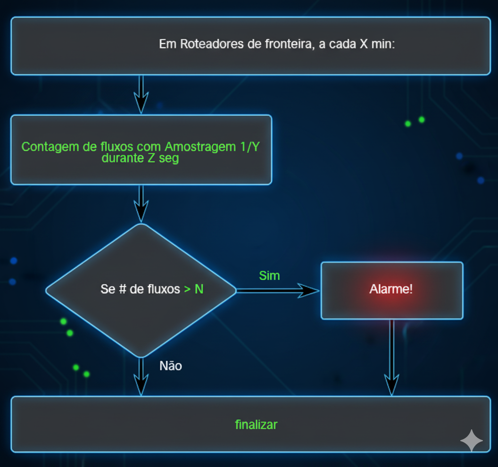

# Detecção de Anomalias de Rede

## Introdução

No campo da cibersegurança, existem duas abordagens principais para a detecção de ameaças. A primeira, baseada em assinaturas, procura por padrões de ataques já conhecidos (como um "retrato falado" de um criminoso). A segunda, e cada vez mais crucial, é a **detecção de anomalias**. Esta abordagem não procura por ameaças conhecidas, mas sim por **desvios do comportamento normal** da rede.

A premissa é simples: primeiro, aprenda o que é "normal"; depois, qualquer coisa que fuja significativamente desse padrão é potencialmente suspeita ou maliciosa. Essa técnica é poderosa por sua capacidade de detectar ataques novos ou de dia zero (*zero-day*) para os quais ainda não existe uma assinatura. Este artigo utilizará um fluxograma de exemplo para desmembrar o processo e os princípios da detecção de anomalias de rede.

---

### 1. O Fluxo de Trabalho Prático de um Sistema de Detecção

O fluxograma fornecido ilustra um algoritmo de detecção de anomalias focado no volume de fluxos de rede, um método eficaz para identificar certos tipos de ataques, como os de Negação de Serviço (DDoS). Vamos analisar seu processo passo a passo.

* **Passo 1: Local e Frequência de Execução**
    * O processo é executado em um local estratégico da rede: nos **roteadores de fronteira**.
    * Ele é acionado periodicamente, a cada **X minutos**.

* **Passo 2: Coleta e Medição de Dados**
    * A ação principal é a **contagem de fluxos** de rede.
    * Para lidar com o alto volume de tráfego em roteadores de fronteira, a técnica de **Amostragem 1/Y** é utilizada. Isso significa que, em vez de analisar cada fluxo, o sistema analisa estatisticamente uma fração (1 em cada Y) dos fluxos.
    * Essa contagem é realizada por um período de tempo definido de **Z segundos**.

* **Passo 3: Análise e Decisão**
    * Após o período de coleta, o sistema realiza uma verificação condicional: **Se o número de fluxos contados for maior que um limite N** (`Se # de fluxos > N`).
    * Este "N" representa a linha de base (*baseline*) ou o limiar do que é considerado um comportamento normal.

* **Passo 4: Resposta e Finalização**
    * Se a contagem de fluxos ultrapassar o limite N, a condição é atendida ("Sim") e o sistema gera um **Alarme!**.
    * Se a contagem estiver dentro dos limites normais, a condição não é atendida ("Não") e o processo é **finalizado** até o próximo ciclo.

---

### 2. Os Pilares da Detecção de Anomalias

O fluxograma exemplifica os três pilares que sustentam qualquer sistema de detecção de anomalias.

1.  **Criação da Linha de Base (Baselining):** O valor "N" no fluxograma não é um número arbitrário. Ele é o resultado de um processo de **baselining**, onde o sistema monitora a rede por um longo período (horas, dias ou semanas) para "aprender" o que constitui a operação normal. A linha de base estabelece, por exemplo, qual é o número médio de fluxos por segundo em uma tarde de terça-feira versus um domingo de madrugada.

2.  **Monitoramento de Métricas:** A "contagem de fluxos" é uma das muitas métricas que podem ser monitoradas. Outras métricas comuns para detecção de anomalias incluem:
    * **Volume de Tráfego:** Medido em bytes ou pacotes por segundo.
    * **Distribuição de Protocolos:** Uma mudança súbita na proporção de tráfego TCP vs. UDP pode ser uma anomalia.
    * **Conexões e Sessões:** O número de novas conexões por segundo.
    * **Tamanho dos Pacotes:** Uma alteração no tamanho médio dos pacotes.

3.  **Análise e Alerta:** A comparação `> N` é a forma mais simples de análise. Sistemas mais avançados utilizam modelos estatísticos (como desvio padrão) ou algoritmos de *machine learning* para identificar anomalias mais sutis e reduzir o número de falsos positivos.

---

### 3. Aplicações Práticas em Cibersegurança

A lógica demonstrada no fluxograma é diretamente aplicável à detecção de vários tipos de ataques:

* **Ataques de Negação de Serviço (DDoS):** Um aumento massivo e repentino no número de fluxos e pacotes, vindo de múltiplas fontes, é o principal indicador de um ataque DDoS volumétrico. O algoritmo do fluxograma é ideal para detectar este cenário.
* **Varreduras de Rede (Scanning):** Quando um atacante realiza uma varredura de portas ou de hosts, um único endereço IP de origem gera um número anormalmente alto de fluxos para múltiplos destinos em um curto período, criando uma anomalia detectável.
* **Propagação de Worms:** Um worm de rede que se espalha rapidamente irá gerar um pico de tráfego e um aumento no número de fluxos entre os hosts internos, um comportamento que se desvia drasticamente da linha de base de comunicação interna.

### Conclusão

A detecção de anomalias representa uma mudança de uma defesa reativa, baseada em assinaturas, para uma abordagem proativa e comportamental. Como o fluxograma ilustra, o processo fundamental envolve a criação de uma linha de base do que é normal, o monitoramento contínuo de métricas chave e a geração de alertas quando ocorrem desvios significativos. Em um cenário onde as ameaças estão em constante evolução, essa capacidade de detectar o "estranho" e o "inesperado" é essencial para identificar e responder a ataques de dia zero e outras ameaças avançadas.